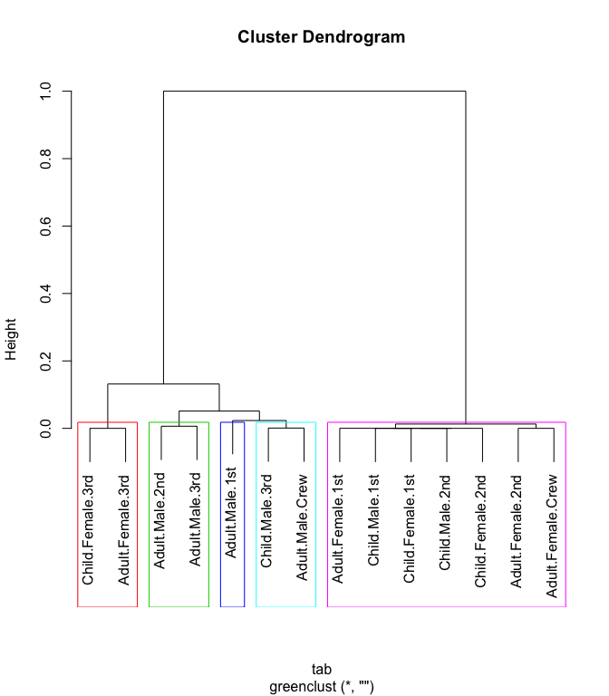

<!-- README.md is generated from README.Rmd. Please edit that file -->
greenclust
==========

Overview
--------

The `greenclust` package implements a method of grouping/clustering the categories of a contingency table in a way that preserves as much of the original variance as possible. It is well-suited for reducing the number of levels of a categorical feature in logistic regression (or any other model having a categorical outcome), while still maintaining some degree of explanatory power.

It does this by iteratively collapsing the rows two at a time, similar to other agglomerative hierarchical clustering methods. At each step, it selects the pair of rows whose combination results in a new table with the smallest loss of chi-squared. This process is often refered to "Greenacre's Method", particularly in the SAS community, after statistician Michael J. Greenacre.

The returned object is an extended version of the [`hclust`](https://stat.ethz.ch/R-manual/R-devel/library/stats/html/hclust.html) object used in the [`stats`](https://stat.ethz.ch/R-manual/R-devel/library/stats/html/stats-package.html) package and can be used similarly (plotted as a dendrogram, cut, etc.). Additional functions are provided in the package for automatic cutting and diagnostic plotting.

Installation
------------

You can install the current version of `greenclust` directly from this GitHub repository using the [devtools package](https://www.rstudio.com/products/rpackages/devtools/):

``` r
# install.packages("devtools")
devtools::install_github("jeffjetton/greenclust")
```

Examples
--------

The `greenclust()` function works like `hclust()`, only it accepts a contingency table rather than a dissimilarity matrix. For the purposes of this example, we'll merge the categorical features of the [Titanic](https://stat.ethz.ch/R-manual/R-devel/library/datasets/html/Titanic.html) data set into a single, monolithic category.

``` r
# Combine Titanic passenger attributes into a single category
tab <- t(as.data.frame(apply(Titanic, 4:1, FUN=sum)))

# Remove rows with all zeros (not valid for chi-squared test)
tab <- tab[apply(tab, 1, sum) > 0, ]
```

This gives us a contingency table with several levels, showing the total number of passengers who survived (or not) at each level:

    ##                    No Yes
    ## Child.Male.1st      0   5
    ## Adult.Male.1st    118  57
    ## Child.Female.1st    0   1
    ## Adult.Female.1st    4 140
    ## Child.Male.2nd      0  11
    ## Adult.Male.2nd    154  14
    ## Child.Female.2nd    0  13
    ## Adult.Female.2nd   13  80
    ## Child.Male.3rd     35  13
    ## Adult.Male.3rd    387  75
    ## Child.Female.3rd   17  14
    ## Adult.Female.3rd   89  76
    ## Adult.Male.Crew   670 192
    ## Adult.Female.Crew   3  20

From there, we can perform our clustering:

``` r
# Create greenclust tree object from table
library(greenclust)
grc <- greenclust(tab)

# Alternatively, to show details of each step:
# grc <- greenclust(tab, verbose=TRUE)

# Result can be plotted like any standard hclust tree
plot(grc)
```


The "height" in this case is the reduction in r-squared. That is, the proportion of chi-squared, relative to the original uncollapsed table, that is lost at each given clustering node.

### Other Functions

The package provides a special plotting function, `greenplot()`, that shows the r-squared and chi-squared test p-value for each potential number of groups/clusters. This can be a useful aid in weighing the trade-off between fewer clusters and lower r-squared:

``` r
greenplot(grc)
```


When using this method, the customary "optimal" number of groups is found at most-significant chi-squared test (i.e., lowest p-value). This point is automatically highlighted by `greenplot()`.

The `greencut()` function is essentially a version of `cutree()` that cuts a greenclust tree at this optimal level by default:

``` r
greencut(grc)
##    Child.Male.1st    Adult.Male.1st  Child.Female.1st  Adult.Female.1st 
##                 1                 2                 1                 1 
##    Child.Male.2nd    Adult.Male.2nd  Child.Female.2nd  Adult.Female.2nd 
##                 1                 3                 1                 1 
##    Child.Male.3rd    Adult.Male.3rd  Child.Female.3rd  Adult.Female.3rd 
##                 4                 3                 5                 5 
##   Adult.Male.Crew Adult.Female.Crew 
##                 4                 1 
## attr(,"r.squared")
## [1] 0.9872221
## attr(,"p.value")
## [1] 1.398205e-137
```

Note that `greencut()` also includes the r-squared and p-value for that particular clustering level as vector attributes. If you want a different cut point, but would still like to have these attributes, you can override automatic selection by specifying either `k` (number of clusters) or `h` (height, or 1 - r-squared):

``` r
greencut(grc, k=3)
##    Child.Male.1st    Adult.Male.1st  Child.Female.1st  Adult.Female.1st 
##                 1                 2                 1                 1 
##    Child.Male.2nd    Adult.Male.2nd  Child.Female.2nd  Adult.Female.2nd 
##                 1                 2                 1                 1 
##    Child.Male.3rd    Adult.Male.3rd  Child.Female.3rd  Adult.Female.3rd 
##                 2                 2                 3                 3 
##   Adult.Male.Crew Adult.Female.Crew 
##                 2                 1 
## attr(,"r.squared")
## [1] 0.948656
## attr(,"p.value")
## [1] 1.208027e-134
```

------------------------------------------------------------------------

Putting it all together:

``` r
clusters <- greencut(grc)

plot(grc)
rect.hclust(grc, max(clusters), border=unique(clusters)+1)
```



``` r

# Categories by cluster number
cbind(clusters, tab)[order(clusters, rownames(tab)), ]
##                   clusters  No Yes
## Adult.Female.1st         1   4 140
## Adult.Female.2nd         1  13  80
## Adult.Female.Crew        1   3  20
## Child.Female.1st         1   0   1
## Child.Female.2nd         1   0  13
## Child.Male.1st           1   0   5
## Child.Male.2nd           1   0  11
## Adult.Male.1st           2 118  57
## Adult.Male.2nd           3 154  14
## Adult.Male.3rd           3 387  75
## Adult.Male.Crew          4 670 192
## Child.Male.3rd           4  35  13
## Adult.Female.3rd         5  89  76
## Child.Female.3rd         5  17  14

# Create collapsed contingency table
new.tab <- aggregate(tab, by=list(clusters), FUN=sum)[ , 2:3]
rownames(new.tab) <- paste0("clust", unique(clusters))
new.tab
##         No Yes
## clust1  20 270
## clust2 118  57
## clust3 541  89
## clust4 705 205
## clust5 106  90

# New table still shows clear differences in survival rates
round(prop.table(as.matrix(new.tab), 1), 3)
##           No   Yes
## clust1 0.069 0.931
## clust2 0.674 0.326
## clust3 0.859 0.141
## clust4 0.775 0.225
## clust5 0.541 0.459
```

Additional Resources
--------------------

-   Michael J. Greenacre: [Clustering the Rows and Columns of a Contingency Table](https://doi.org/10.1007/BF01901670)
-   Xinghe Lu: [Correcting the Quasi-complete Separation Issue in Logistic Regression Models](https://pdfs.semanticscholar.org/bbb0/2b26cf6a1628b27ddef70a83b92962d6dce2.pdf) (pdf)
