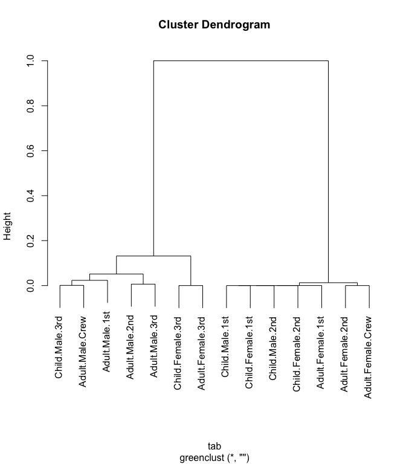

<!-- README.md is generated from README.Rmd. Please edit that file -->
greenclust
==========

Overview
--------

The `greenclust` package implements a method of grouping/clustering the categories of a contingency table in a way that preserves as much of the original variance as possible. It is well-suited for reducing the number of levels of a categorical feature in logistic regression (or any other model having a categorical outcome), while still maintaining some degree of explanatory power.

It does this by iteratively collapsing the rows two at a time, similar to other agglomerative hierarchical clustering methods. At each step, it selects the pair of rows whose combination results in a new table with the smallest loss of chi-squared. This process is often refered to "Greenacre's Method", particularly in the SAS community, after statistician Michael J. Greenacre.

The returned object is an extended version of the [`hclust`](https://stat.ethz.ch/R-manual/R-devel/library/stats/html/hclust.html) object used in the [`stats`](https://stat.ethz.ch/R-manual/R-devel/library/stats/html/stats-package.html) package and can be used similarly (plotted as a dendrogram, cut, etc.). Additional functions are provided in the package for automatic cutting, diagnostic plotting, and assigning derived clusters back to the source data.

Installation
------------

You can install the current version of `greenclust` directly from this GitHub repository using the [devtools package](https://www.rstudio.com/products/rpackages/devtools/):

``` r
# install.packages("devtools")
devtools::install_github("jeffjetton/greenclust")
```

Examples
--------

The `greenclust()` function works like `hclust()`, only it accepts a contingency table rather than a dissimilarity matrix. For the purposes of this example, we'll merge the categorical features of the [Titanic](https://stat.ethz.ch/R-manual/R-devel/library/datasets/html/Titanic.html) data set into a single, monolithic category.

``` r
# Combine Titanic passenger attributes into a single category
tab <- t(as.data.frame(apply(Titanic, 4:1, FUN=sum)))

# Remove rows with all zeros (not valid for chi-squared test)
tab <- tab[apply(tab, 1, sum) > 0, ]
```

This gives us a contingency table with several levels, showing the total number of passengers who survived (or not) at each level:

    ##                    No Yes
    ## Child.Male.1st      0   5
    ## Adult.Male.1st    118  57
    ## Child.Female.1st    0   1
    ## Adult.Female.1st    4 140
    ## Child.Male.2nd      0  11
    ## Adult.Male.2nd    154  14
    ## Child.Female.2nd    0  13
    ## Adult.Female.2nd   13  80
    ## Child.Male.3rd     35  13
    ## Adult.Male.3rd    387  75
    ## Child.Female.3rd   17  14
    ## Adult.Female.3rd   89  76
    ## Adult.Male.Crew   670 192
    ## Adult.Female.Crew   3  20

From there, we can perform our clustering:

``` r
# Create greenclust tree object from table
library(greenclust)
grc <- greenclust(tab)

# Alternatively, to show details of each step:
# grc <- greenclust(tab, verbose=TRUE)

# Result can be plotted like any standard hclust tree
plot(grc)
```



The "height" in this case is the reduction in r-squared. That is, the proportion of chi-squared, relative to the original uncollapsed table, that is lost when the two categories are combined at each clustering step.

### Other Functions

#### greenplot

The package provides a diagnostic plotting function that shows the r-squared and chi-squared test p-value for each potential number of groups/clusters. This can be a useful tool when weighing the trade-off between fewer clusters and lower r-squared:

``` r
greenplot(grc)
```


When using this method, the customary "optimal" number of groups is found at most-significant chi-squared test (i.e., lowest p-value). This point is automatically highlighted by `greenplot()`.

#### greencut

`greencut()` is essentially a version of `cutree()` that cuts a greenclust tree at the optimal level (mentioned above) by default:

``` r
greencut(grc)
##    Child.Male.1st    Adult.Male.1st  Child.Female.1st  Adult.Female.1st 
##                 1                 2                 1                 1 
##    Child.Male.2nd    Adult.Male.2nd  Child.Female.2nd  Adult.Female.2nd 
##                 1                 3                 1                 1 
##    Child.Male.3rd    Adult.Male.3rd  Child.Female.3rd  Adult.Female.3rd 
##                 4                 3                 5                 5 
##   Adult.Male.Crew Adult.Female.Crew 
##                 4                 1 
## attr(,"r.squared")
## [1] 0.9872221
## attr(,"p.value")
## [1] 1.398205e-137
```

Note that `greencut()` also includes the r-squared and p-value for that particular clustering level as vector attributes. If you want a different cut point, but would still like to have these attributes, you can override automatic selection by specifying either `k` (number of clusters) or `h` (height, or 1 - r-squared):

``` r
greencut(grc, k=3)
##    Child.Male.1st    Adult.Male.1st  Child.Female.1st  Adult.Female.1st 
##                 1                 2                 1                 1 
##    Child.Male.2nd    Adult.Male.2nd  Child.Female.2nd  Adult.Female.2nd 
##                 1                 2                 1                 1 
##    Child.Male.3rd    Adult.Male.3rd  Child.Female.3rd  Adult.Female.3rd 
##                 2                 2                 3                 3 
##   Adult.Male.Crew Adult.Female.Crew 
##                 2                 1 
## attr(,"r.squared")
## [1] 0.948656
## attr(,"p.value")
## [1] 1.208027e-134
```

#### assign.cluster

After clustering, you'll typically want to associate the resulting cluster numbers back to the original data. For example, if we clustered the feed supplements of the [chickwts](https://stat.ethz.ch/R-manual/R-devel/library/datasets/html/chickwts.html) data based on the number of "underweight" chicks and then cut the tree, the resulting vector would have an element for each unique category level, rather than an element for each actual observation:

``` r
chick.table <- table(chickwts$feed,
                     ifelse(chickwts$weight < 200, "Y", "N"))
chick.tree <- greenclust(chick.table)
# Use the default cut point
chick.clusters <- greencut(chick.tree)

# The resulting six-element vector shows the cluster number for each level
chick.clusters
##    casein horsebean   linseed  meatmeal   soybean sunflower 
##         1         2         3         1         3         1 
## attr(,"r.squared")
## [1] 0.9842772
## attr(,"p.value")
## [1] 1.790278e-06
```

`assign.cluster()` is a simple convenience function for expanding those cluster numbers back out:

``` r
chickwts$cluster <- assign.cluster(chickwts$feed, chick.clusters)

# Sample of data with new cluster numbers
chickwts[9:13, ]
##    weight      feed cluster
## 9     143 horsebean       2
## 10    140 horsebean       2
## 11    309   linseed       3
## 12    229   linseed       3
## 13    181   linseed       3

# Observation counts by original level and new cluster
print(table(chickwts$feed, chickwts$cluster))
##            
##              1  2  3
##   casein    12  0  0
##   horsebean  0 10  0
##   linseed    0  0 12
##   meatmeal  11  0  0
##   soybean    0  0 14
##   sunflower 12  0  0
```

------------------------------------------------------------------------

Additional Resources
--------------------

-   Michael J. Greenacre: [Clustering the Rows and Columns of a Contingency Table](https://doi.org/10.1007/BF01901670)
-   Xinghe Lu: [Correcting the Quasi-complete Separation Issue in Logistic Regression Models](https://pdfs.semanticscholar.org/bbb0/2b26cf6a1628b27ddef70a83b92962d6dce2.pdf) (pdf)
